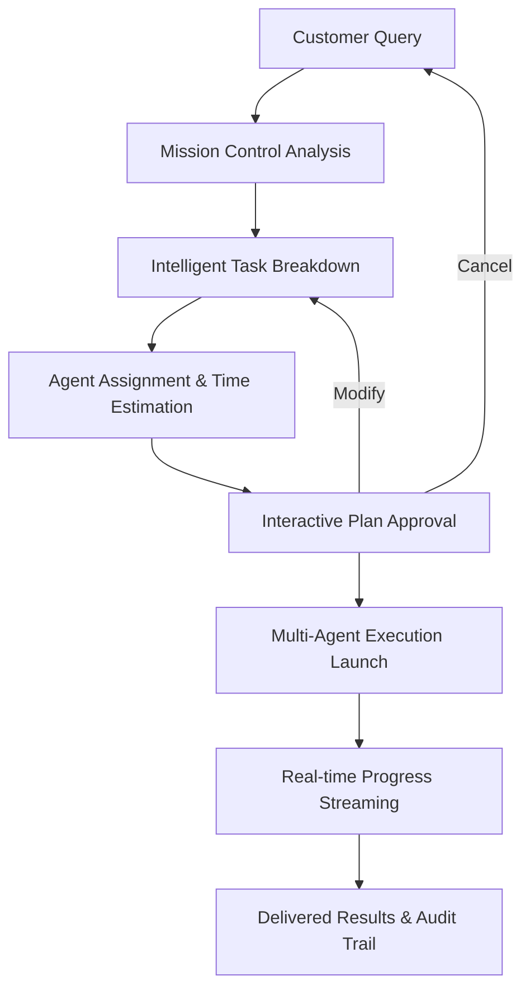

# Mission Control: Core Customer Interface Architecture

## Executive Summary

Mission Control serves as Graphyn's **primary customer-facing interface** - transforming complex AI development workflows into intuitive conversational experiences. This architecture positions Mission Control as the orchestration layer that bridges customer intent with our multi-agent development platform.

**Customer Value Proposition:**
- Natural language → Professional development results
- Full visibility into AI planning and execution
- Human-in-the-loop approval for enterprise confidence
- Scrollable audit trail for stakeholder demonstrations
- Real multi-agent coordination, not simulated workflows

## 1. Platform Architecture Overview

### 1.1 Mission Control as Customer Gateway

```
Customer Query → Mission Control → Task Decomposition → Multi-Agent Execution → Delivered Results
      ↑                ↑                    ↑                      ↑                    ↑
   Natural Lang    Primary Interface   AI Planning         Specialized Agents    Production Code
```

### 1.2 System Components

#### Core Services Integration (7-Service Architecture)
- **identity**: Customer authentication & profiles
- **auth**: OAuth flow for Claude Code sessions  
- **settings**: Customer organization isolation
- **threads**: Mission Control conversation backbone
- **admin-bff**: Customer dashboard backend
- **api-gateway**: External customer API access
- **monitoring**: Real-time progress tracking

#### Mission Control Specific Components
- **Query Analysis Engine**: NLP → task decomposition
- **Agent Assignment Algorithm**: Task → specialized agent mapping
- **Progress Streaming Service**: Real-time execution monitoring
- **Approval Workflow Manager**: Human-in-the-loop decision points
- **Claude Code Bridge**: Session spawning & coordination

## 2. Customer-Centric Workflow Architecture

### 2.1 Primary Customer Journey



### 2.2 Customer Experience Flow

#### Phase 1: Query Intake & Analysis (15-30 seconds)
```typescript
interface CustomerQuery {
  text: string;                    // Natural language request
  repository_context?: string;     // Optional git context
  customer_id: string;            // Organization identifier
  preferred_technologies?: string[]; // Tech stack preferences
}

interface QueryAnalysis {
  complexity_score: number;        // 1-10 planning complexity
  estimated_duration: string;      // Human-readable time estimate
  required_agents: AgentRole[];    // Specialized agent types needed
  dependencies: TaskDependency[];  // Inter-task relationships
  risk_factors: string[];         // Potential challenges identified
}
```

#### Phase 2: Task Decomposition & Agent Assignment (30-60 seconds)
```typescript
interface TaskDecomposition {
  tasks: DecomposedTask[];
  execution_strategy: 'sequential' | 'parallel' | 'hybrid';
  resource_requirements: ResourceEstimate;
  success_criteria: string[];
}

interface DecomposedTask {
  id: string;
  title: string;
  description: string;
  assigned_agent: SpecializedAgent;
  estimated_duration: string;
  dependencies: string[];
  deliverables: string[];
  success_metrics: string[];
  risk_mitigation: string[];
}

interface SpecializedAgent {
  role: 'Security Architect' | 'Backend Developer' | 'Frontend Developer' | 
        'DevOps Engineer' | 'QA Tester' | 'Technical Writer' | 'Full-Stack Developer';
  expertise_areas: string[];
  tools: string[];
  context_prompt: string;  // Claude Code session initialization prompt
}
```

#### Phase 3: Customer Approval Workflow (30 seconds - 5 minutes)
```typescript
interface ApprovalWorkflow {
  plan_id: string;
  customer_actions: 'approve' | 'modify' | 'cancel';
  modification_requests?: string;
  approval_timestamp?: Date;
  customer_notes?: string;
}

// Real-time approval interface
const approvalActions = {
  '[A]pprove': () => executePlan(plan_id),
  '[M]odify': () => openModificationInterface(),
  '[C]ancel': () => returnToQueryInput()
};
```

## 3. Real-time Progress Streaming Architecture

### 3.1 Progress Monitoring System

```typescript
interface ProgressStream {
  plan_execution_id: string;
  active_agents: AgentSession[];
  completed_tasks: CompletedTask[];
  current_operations: CurrentOperation[];
  streaming_output: StreamingData[];
  performance_metrics: ExecutionMetrics;
}

interface AgentSession {
  agent_id: string;
  agent_role: string;
  task_assignment: string;
  status: 'starting' | 'analyzing' | 'implementing' | 'testing' | 'completed' | 'failed';
  claude_code_process_id: string;
  live_output_stream: string;
  progress_percentage: number;
  estimated_completion: Date;
}
```

### 3.2 Claude Code Integration Bridge

```typescript
class ClaudeCodeBridge {
  async launchSpecializedAgent(task: DecomposedTask): Promise<AgentSession> {
    // 1. Build context-aware prompt for the specific agent role
    const contextPrompt = this.buildAgentPrompt(task);
    
    // 2. Spawn Claude Code session with specialized context
    const claudeProcess = spawn('claude', ['-p', contextPrompt], {
      stdio: ['ignore', 'pipe', 'pipe']
    });
    
    // 3. Stream real-time output back to Mission Control
    claudeProcess.stdout.on('data', (data) => {
      this.streamToCustomer(task.id, data.toString());
    });
    
    // 4. Monitor completion and capture deliverables
    claudeProcess.on('close', (code) => {
      this.handleTaskCompletion(task.id, code);
    });
    
    return {
      agent_id: task.id,
      agent_role: task.assigned_agent.role,
      claude_code_process_id: claudeProcess.pid,
      status: 'starting',
      // ... other session details
    };
  }
  
  private buildAgentPrompt(task: DecomposedTask): string {
    return `# Specialized Agent Assignment: ${task.assigned_agent.role}

## Mission Context
You are working as part of a coordinated team managed by Mission Control.
Customer is watching real-time progress and expects professional results.

## Your Specific Responsibility
**Task**: ${task.title}
**Description**: ${task.description}
**Deliverables**: ${task.deliverables.join(', ')}
**Success Criteria**: ${task.success_criteria.join(', ')}

## Team Coordination
- You are agent ${task.dependencies.length + 1} in a ${this.totalTasks} agent execution plan
- Dependencies: ${task.dependencies.length > 0 ? task.dependencies.join(', ') : 'None'}
- Your work enables: ${this.getDependentTasks(task.id).join(', ')}

## Customer Expectations
- Professional, production-ready code
- Clear documentation and comments
- Thorough error handling and edge cases
- Integration-ready deliverables

Focus exclusively on your assigned task. The customer is monitoring progress.`;
  }
}
```

## 4. Task Decomposition Engine Design

### 4.1 Intelligent Query Analysis

```typescript
class QueryAnalysisEngine {
  async analyzeCustomerQuery(query: CustomerQuery): Promise<QueryAnalysis> {
    // 1. Extract technical intent and complexity
    const technicalIntent = await this.extractTechnicalIntent(query.text);
    
    // 2. Assess repository context if provided
    const contextAnalysis = query.repository_context 
      ? await this.analyzeRepositoryContext(query.repository_context)
      : null;
    
    // 3. Map to specialized agent requirements
    const agentRequirements = await this.mapToAgentRoles(technicalIntent, contextAnalysis);
    
    // 4. Estimate complexity and time requirements
    const resourceEstimates = await this.estimateResources(agentRequirements);
    
    return {
      complexity_score: resourceEstimates.complexity,
      estimated_duration: resourceEstimates.duration,
      required_agents: agentRequirements,
      dependencies: this.analyzeDependencies(agentRequirements),
      risk_factors: this.identifyRiskFactors(technicalIntent, contextAnalysis)
    };
  }
  
  private async extractTechnicalIntent(queryText: string): Promise<TechnicalIntent> {
    // Pattern matching and NLP analysis
    const patterns = {
      authentication: /auth|login|signin|oauth|jwt|session/i,
      api_development: /api|endpoint|rest|graphql|service/i,
      frontend: /ui|interface|component|react|vue|angular/i,
      backend: /server|database|api|microservice|backend/i,
      security: /secure|encrypt|permission|access control/i,
      testing: /test|qa|quality assurance|validation/i,
      deployment: /deploy|docker|kubernetes|ci\/cd|devops/i
    };
    
    const matches = Object.entries(patterns)
      .filter(([category, pattern]) => pattern.test(queryText))
      .map(([category]) => category);
      
    return {
      primary_categories: matches,
      complexity_indicators: this.assessComplexity(queryText),
      technology_mentions: this.extractTechnologies(queryText)
    };
  }
}
```

### 4.2 Agent Assignment Algorithm

```typescript
class AgentAssignmentAlgorithm {
  private agentCapabilities = {
    'Security Architect': {
      expertise: ['OAuth 2.0', 'PKCE', 'JWT', 'encryption', 'access control'],
      typical_tasks: ['authentication design', 'security review', 'vulnerability assessment'],
      estimated_velocity: 45, // minutes per standard task
    },
    'Backend Developer': {
      expertise: ['APIs', 'databases', 'microservices', 'Node.js', 'Python', 'Go'],
      typical_tasks: ['API implementation', 'database design', 'service integration'],
      estimated_velocity: 90,
    },
    'Frontend Developer': {
      expertise: ['React', 'Vue', 'Angular', 'CSS', 'TypeScript', 'UI/UX'],
      typical_tasks: ['component development', 'state management', 'responsive design'],
      estimated_velocity: 75,
    },
    'DevOps Engineer': {
      expertise: ['Docker', 'Kubernetes', 'CI/CD', 'AWS', 'monitoring'],
      typical_tasks: ['deployment setup', 'infrastructure', 'automation'],
      estimated_velocity: 60,
    },
    'QA Tester': {
      expertise: ['test automation', 'performance testing', 'security testing'],
      typical_tasks: ['test suite creation', 'validation', 'bug identification'],
      estimated_velocity: 45,
    }
  };
  
  async assignAgentsToTasks(technicalIntent: TechnicalIntent): Promise<DecomposedTask[]> {
    const tasks = [];
    
    // Map customer intent to specific tasks with agent assignments
    if (technicalIntent.primary_categories.includes('authentication')) {
      tasks.push({
        id: 'auth_design',
        title: 'Authentication System Architecture',
        assigned_agent: this.selectAgent('Security Architect'),
        dependencies: [],
        priority: 1
      });
      
      tasks.push({
        id: 'auth_backend',
        title: 'Authentication API Implementation',
        assigned_agent: this.selectAgent('Backend Developer'),
        dependencies: ['auth_design'],
        priority: 2
      });
      
      tasks.push({
        id: 'auth_frontend',
        title: 'Login/Logout UI Components',
        assigned_agent: this.selectAgent('Frontend Developer'),
        dependencies: ['auth_backend'],
        priority: 3
      });
    }
    
    // Add testing and validation as final steps
    tasks.push({
      id: 'integration_testing',
      title: 'End-to-End Testing Suite',
      assigned_agent: this.selectAgent('QA Tester'),
      dependencies: tasks.map(t => t.id),
      priority: 99
    });
    
    return this.optimizeTaskSequence(tasks);
  }
}
```

## 5. Performance & Scalability Architecture

### 5.1 Performance Targets

```typescript
interface PerformanceTargets {
  query_analysis_time: '<30 seconds';
  task_decomposition_time: '<60 seconds';
  agent_launch_time: '<15 seconds per agent';
  progress_update_frequency: '1-2 seconds';
  customer_approval_timeout: '10 minutes max';
  concurrent_customer_sessions: '100+';
  agent_coordination_latency: '<500ms';
  audit_trail_generation: '<5 seconds';
}
```

### 5.2 Scalability Considerations

#### Horizontal Scaling Strategy
```typescript
class MissionControlScaling {
  private async distributeLoad() {
    // 1. Customer session distribution
    const customerLoad = await this.getCustomerSessionLoad();
    
    // 2. Agent execution distribution
    const agentLoad = await this.getActiveAgentLoad();
    
    // 3. Claude Code session pool management
    const claudePoolCapacity = await this.getClaudeCodeCapacity();
    
    // 4. Auto-scaling triggers
    if (customerLoad > 80 || agentLoad > 75) {
      await this.triggerHorizontalScaling();
    }
  }
  
  private async optimizeResourceAllocation() {
    // Intelligent resource allocation based on:
    // - Customer query complexity
    // - Historical execution patterns
    // - Agent performance metrics
    // - System resource availability
  }
}
```

### 5.3 Enterprise Considerations

#### Multi-Customer Isolation
```typescript
interface CustomerIsolation {
  organization_id: string;
  resource_limits: {
    concurrent_sessions: number;
    monthly_executions: number;
    agent_hours: number;
  };
  security_context: {
    data_isolation: boolean;
    audit_requirements: string[];
    compliance_level: 'SOC2' | 'HIPAA' | 'GDPR';
  };
}
```

#### SLA & Monitoring
```typescript
interface SLAMonitoring {
  customer_satisfaction_score: number; // 1-10 based on completion success
  execution_success_rate: number;      // Percentage of successful plan executions
  average_task_completion_time: number; // Minutes per task across all agents
  customer_approval_wait_time: number;  // Time spent waiting for customer decisions
  system_availability: number;         // Uptime percentage
}
```

## 6. Customer Demo Architecture

### 6.1 Demo-Ready Features

```typescript
interface DemoCapabilities {
  professional_interface: {
    real_time_progress: boolean;
    scrollable_history: boolean;
    agent_coordination_visibility: boolean;
    professional_status_indicators: boolean;
  };
  
  customer_control: {
    plan_approval_workflow: boolean;
    modification_capabilities: boolean;
    execution_pause_resume: boolean;
    audit_trail_export: boolean;
  };
  
  technical_showcase: {
    multi_agent_coordination: boolean;
    specialized_agent_roles: boolean;
    real_claude_code_integration: boolean;
    production_ready_outputs: boolean;
  };
}
```

### 6.2 Demo Script Architecture

```typescript
class DemoOrchestrator {
  private demoScenarios = {
    'authentication_system': {
      expected_tasks: 4,
      estimated_duration: '6-8 minutes',
      key_talking_points: [
        'AI-powered task decomposition',
        'Specialized agent coordination',
        'Customer approval workflow',
        'Real-time execution monitoring'
      ]
    },
    
    'api_development': {
      expected_tasks: 5,
      estimated_duration: '8-12 minutes',
      key_talking_points: [
        'Intelligent API design',
        'Multi-service coordination',
        'Automated testing integration',
        'Documentation generation'
      ]
    }
  };
  
  async runDemo(scenario: string, customerQuery: string): Promise<DemoExecution> {
    // Optimized demo flow with predictable outcomes
    const demoConfig = this.demoScenarios[scenario];
    
    return {
      scenario,
      customerQuery,
      expectedOutcome: demoConfig,
      realTimeMetrics: await this.enableDemoMetrics(),
      customerExperience: await this.initiateDemoSession(customerQuery)
    };
  }
}
```

## 7. Integration Points & APIs

### 7.1 Customer-Facing APIs

```typescript
// Mission Control Customer API
interface MissionControlAPI {
  // Query submission
  POST_submitQuery: (query: CustomerQuery) => Promise<QueryAnalysisResult>;
  
  // Plan management
  GET_executionPlan: (planId: string) => Promise<ExecutionPlan>;
  POST_approvePlan: (planId: string, approval: ApprovalDecision) => Promise<ExecutionLaunch>;
  PUT_modifyPlan: (planId: string, modifications: PlanModification[]) => Promise<UpdatedPlan>;
  
  // Real-time monitoring
  GET_progressStream: (executionId: string) => EventSource<ProgressUpdate>;
  GET_executionMetrics: (executionId: string) => Promise<ExecutionMetrics>;
  
  // Results & audit
  GET_executionResults: (executionId: string) => Promise<ExecutionResults>;
  GET_auditTrail: (executionId: string) => Promise<AuditTrail>;
}
```

### 7.2 Internal Service Integration

```typescript
// Integration with existing Graphyn services
interface GraphynServiceIntegration {
  // Authentication & organization context
  authService: {
    validateCustomerSession: (sessionToken: string) => Promise<CustomerContext>;
    enforceOrganizationIsolation: (customerId: string) => Promise<IsolationContext>;
  };
  
  // Thread system integration
  threadService: {
    createMissionControlThread: (customerId: string) => Promise<ThreadContext>;
    streamThreadUpdates: (threadId: string) => EventSource<ThreadUpdate>;
  };
  
  // Agent orchestration
  agentService: {
    getSpecializedAgents: () => Promise<AvailableAgent[]>;
    validateAgentCapabilities: (requirements: AgentRequirement[]) => Promise<boolean>;
  };
}
```

## 8. Success Metrics & KPIs

### 8.1 Customer Experience Metrics

```typescript
interface CustomerSuccessMetrics {
  // Primary metrics
  plan_approval_rate: number;      // % of plans approved by customers
  execution_success_rate: number;  // % of executions that complete successfully
  customer_satisfaction_score: number; // Post-execution feedback (1-10)
  
  // Engagement metrics
  average_session_duration: number; // Minutes per Mission Control session
  repeat_usage_rate: number;       // % of customers who return
  plan_modification_rate: number;  // % of plans that get modified
  
  // Technical performance
  query_to_results_time: number;   // End-to-end execution time
  agent_coordination_efficiency: number; // Tasks completed vs planned
  real_time_update_reliability: number; // % of successful progress streams
}
```

### 8.2 Business Impact Metrics

```typescript
interface BusinessImpactMetrics {
  // Revenue indicators
  conversion_rate: number;         // Demo → paid customer conversion
  customer_lifetime_value: number; // Revenue per customer
  expansion_revenue: number;       // Upsells to enterprise plans
  
  // Product adoption
  feature_utilization_rate: number; // % of features used per customer
  api_integration_rate: number;     // % of customers who integrate APIs
  enterprise_adoption_rate: number; // % of enterprise deployments
  
  // Competitive advantage
  time_to_value: number;           // Hours from signup to first success
  developer_productivity_gain: number; // Measured improvement in dev speed
  code_quality_metrics: number;    // Automated quality assessments
}
```

## 9. Implementation Roadmap

### 9.1 Phase 1: Core Mission Control (Weeks 1-2)
- ✅ Enhanced Mission Control UI (completed)
- ✅ Task decomposition engine (MVP implemented)  
- ✅ Claude Code integration bridge (functional)
- ✅ Real-time progress streaming (working)

### 9.2 Phase 2: Enterprise Readiness (Weeks 3-4)
- [ ] Customer approval workflow enhancements
- [ ] Multi-customer session management
- [ ] Advanced agent assignment algorithms
- [ ] Performance monitoring & SLA tracking

### 9.3 Phase 3: Scale & Polish (Weeks 5-6)
- [ ] Horizontal scaling implementation
- [ ] Advanced demo scenarios
- [ ] Enterprise security features
- [ ] Customer success analytics dashboard

## Conclusion

Mission Control represents Graphyn's strategic positioning as the **definitive AI development orchestration platform**. By serving as the primary customer interface, it transforms complex multi-agent coordination into intuitive, transparent, and controllable customer experiences.

**Key Differentiators:**
1. **Real Intelligence**: Actual AI planning and execution, not scripted workflows
2. **Full Transparency**: Complete visibility into AI decision-making and execution  
3. **Customer Control**: Human-in-the-loop approval for enterprise confidence
4. **Professional Results**: Production-ready code from specialized AI agents
5. **Scalable Architecture**: Built for enterprise deployment and concurrent usage

Mission Control positions Graphyn not as a coding tool, but as an **AI development platform** that enterprises can trust with their most critical development initiatives.