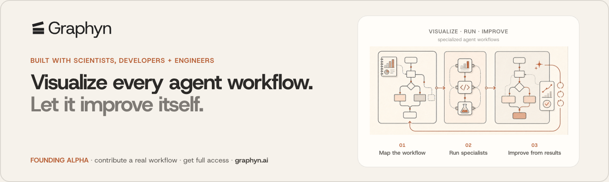

# Graphyn Code

**The open-source junction between local agent harnesses and Graphyn's Rust runtime.**

[](LICENSE)

<a href="https://graphyn.ai/?utm_source=github&amp;utm_medium=sponsorship&amp;utm_campaign=graphyn_founding_alpha&amp;utm_content=awesome_datascience_banner">
  
</a>

[graphyn.ai](https://graphyn.ai/?utm_source=github&utm_medium=sponsorship&utm_campaign=graphyn_founding_alpha&utm_content=awesome_datascience_banner) · [github.com/fuego-wtf/graphyn-code](https://github.com/fuego-wtf/graphyn-code)

Graphyn Code is the TypeScript command-line interface and capability-routing layer for Graphyn. It gives people and local agents one stable entry point into multiple agent harnesses, local knowledge, schedules, filesystem capabilities, and the Graphyn desktop runtime.

The long-term role is simple: local agents should be able to find one another, exchange work, and coordinate through a fast, observable junction. The Graphyn desktop Agent Client Protocol (ACP) runtime remains the authority for sessions, approvals, and execution. Graphyn Code routes requests into that runtime and other capability domains. It does not bypass their security boundaries.

> **Project status:** active pre-alpha. The source builds today. Read-only cross-harness consults work through Claude, Codex, and Gemini subprocess adapters. ACP-over-stdio is present as an experimental opt-in tier and is not the default production path.

<!-- prettier-ignore -->
> [!NOTE]
> ACP-over-stdio consult transport is experimental and under active development. The read-only subprocess tier remains the default.

## Why this repository exists

Agent tools are becoming good at isolated tasks, but each tool still has its own process, protocol, permissions, and output shape. Connecting them directly creates a mesh of one-off integrations.

Graphyn Code turns that mesh into a junction:

1. A caller sends one explicit request.
2. The command dispatcher or capability router selects the correct domain and transport.
3. The adapter applies the domain's safety and transformation contract.
4. The result returns in a normalized envelope with an auditable receipt.

This repository owns the junction and command surface. The Rust base and desktop repositories own local runtime execution.

## Architecture

The current command surface combines direct command dispatch with domain-based
capability routing:

```text
human or local agent
        |
        v
  graphyn command
        |
        v
  @graphyn/code
  command dispatcher + CapabilityRouter
        |
        +-- harness/*  --> Claude, Codex, or Gemini consult
        |                 current: read-only subprocess
        |                 experimental: ACP over stdio
        |
        +-- base/*     --> Graphyn Rust base CLI
        |                 local knowledge and deterministic capabilities
        |
        +-- schedule/* --> authenticated service adapter
        |                 desktop ACP remains execution authority
        |
        +-- fs/*       --> ACL-gated local filesystem inspection
```

### Authority boundary

Graphyn Code is a consult proxy and CLI junction. It is not the runtime authority.

- The Graphyn desktop Rust backend owns ACP sessions, execution, approvals, and runtime state.
- The Graphyn Rust base binary owns deterministic local knowledge and base capabilities.
- Graphyn Code owns command parsing, capability routing, input transformation, transport adapters, normalized errors, and receipts.
- External Model Context Protocol (MCP) integrations remain separate from Graphyn's base-critical path.

That split lets the public CLI evolve without quietly creating a second execution runtime.

## What works today

Use this table to identify which surfaces run from this repository and which
surfaces require another local runtime or service:

| Surface                            | Current state                                                       | Requirement                                |
| ---------------------------------- | ------------------------------------------------------------------- | ------------------------------------------ |
| `graphyn consult --to <harness>`   | Read-only one-shot consults for Claude, Codex, and Gemini           | Target harness installed and authenticated |
| `graphyn consult --tier acp`       | Experimental ACP-over-stdio transport                               | Explicit opt-in and compatible harness     |
| `graphyn base <task>`              | Routes deterministic requests to the Rust base CLI and returns JSON | Graphyn base binary available              |
| `graphyn fs <subcommand>`          | ACL-gated local virtual filesystem inspection                       | Local filesystem permission                |
| `graphyn schedule <subcommand>`    | Create, inspect, run, and govern scheduled agent work               | Authenticated Graphyn service and runtime  |
| `graphyn env` and `graphyn config` | Environment onboarding and non-secret configuration checks          | Registered local configuration             |
| `graphyn mcp`                      | MCP server and configuration surface for external integrations      | Compatible MCP client                      |

Run the current command index instead of relying on this table alone:

```bash
bun bin/graphyn.js --help
```

## Quick start from source

Graphyn Code uses Bun for local development and verification.

```bash
git clone https://github.com/fuego-wtf/graphyn-code.git
cd graphyn-code
bun install
bun run build
bun bin/graphyn.js --help
```

### Ask another local agent harness

```bash
bun bin/graphyn.js consult --to gemini \
  "Review this repository's public API boundary"

bun bin/graphyn.js consult --to codex \
  "Find the smallest safe fix for the failing test"

bun bin/graphyn.js consult --to claude \
  "Compare the implementation with the architecture document"
```

Consults default to the shipped read-only subprocess tier. The junction strips secret-shaped environment variables, applies the input transformation policy, limits recursion depth, and returns timing plus trace receipts.

### Use the Rust base runtime

The Rust runtime is not bundled into this repository. Point the junction at a compatible Graphyn base build:

```bash
export GRAPHYN_BASE_BIN=/absolute/path/to/graphyn-workspace/packages/base/target/release/graphyn
bun bin/graphyn.js base "find the decisions behind the capture pipeline"
```

If the binary is absent, Graphyn Code fails explicitly instead of fabricating a result.

### Inspect the local command surface

```bash
bun bin/graphyn.js doctor
bun bin/graphyn.js config check --json
bun bin/graphyn.js fs ls .
```

Commands that require a desktop runtime, service, or external harness report that dependency when it is unavailable.

## The Graphyn workflow

The current product direction has three stages:

1. **Capture:** sessions arrive from tools people already use.
2. **Structure:** repeated moves become visible, named workflows.
3. **Replay and improve:** specialized agents run those workflows, preserve receipts, and improve from measured outcomes.

Graphyn Code is the junction inside that system. Session capture and durable runtime state belong to the desktop and Rust layers. Workflow visualization and outcome-driven improvement are product direction, not claims that every loop is already autonomous in this repository.

## Local latency

The junction is designed for local, measurable handoffs. Consult results already include `durationMs`, and the experimental tier uses ACP-over-stdio rather than a remote orchestration service.

There is no public millisecond latency service-level agreement yet. End-to-end time includes harness startup and model inference, which are not millisecond operations. The near-term engineering target is to benchmark and minimize the local routing and agent-to-agent handoff overhead independently from model time.

If you contribute latency work, include:

- warm and cold measurements;
- routing overhead separated from inference time;
- machine and harness versions;
- p50, p95, and failure rate;
- a reproducible Bun command.

## Safety model

Cross-harness consults are advisory by default.

- Claude receives only `Read`, `Glob`, and `Grep` tools.
- Codex runs in its read-only sandbox with user configuration ignored.
- Gemini runs in plan mode and its output is rejected if file writes are reported.
- Secret-shaped environment variables are removed before a leaf process starts.
- Each consult carries a trace ID, recursion depth, transformation hashes, timing, and a read-only receipt.
- Experimental ACP transport must be selected explicitly.

Do not weaken these boundaries to make a demo pass. A junction that cannot explain how a request moved is not ready to coordinate execution.

## Founding alpha

Graphyn is working with scientists, developers, and engineers to improve specialized agent workflows against real work.

If you repeat a workflow that crosses notebooks, terminals, repositories, models, or machines, [open a workflow proposal](https://github.com/fuego-wtf/graphyn-code/issues/new). Include:

1. the input and desired result;
2. the agents and tools involved;
3. the approval boundaries;
4. what a successful run looks like;
5. what should improve after each run.

Selected founding contributors receive access to the alpha surfaces needed to test the accepted workflow and work directly with the Graphyn team on the junction contract. This is a contributor program, not an unlimited-lifetime commercial entitlement.

## Roadmap

The roadmap separates current implementation from experimental work and product
direction:

- **Shipped:** domain-based capability router and read-only Claude, Codex, and Gemini consult adapters.
- **Shipped:** secret stripping, transform receipts, trace propagation, timeout handling, and normalized failure envelopes.
- **Experimental:** ACP-over-stdio consult transport.
- **Next:** make the Graphyn Code to desktop Rust junction a stable public contract.
- **Next:** publish reproducible local handoff latency benchmarks.
- **Direction:** visualize specialized workflows and improve them from measured results while keeping execution governed by explicit approvals.

## Repository map

The public repository keeps the junction implementation and its verification
surfaces together:

```text
graphyn-code/
├── bin/graphyn.js                  # executable entry point
├── src/index.ts                    # current command routing
├── src/adapters/                   # capability-domain adapters
├── src/consult/                    # cross-harness junction and ACP transport
├── src/commands/                   # deterministic command implementations
├── src/mcp/                        # external MCP bridge surface
├── tests/                          # unit, contract, and integration coverage
├── assets/                         # public README assets
└── package.json                    # Bun scripts and package metadata
```

Durable cross-repository runtime documentation lives in the parent Graphyn workspace. This public repository keeps the command contract, source-level comments, tests, and contributor-facing documentation needed to understand the extracted CLI.

## Development

Run the complete local verification sequence before submitting changes:

```bash
bun install
bun run build
bun run test
bun run test:package
```

Before opening a pull request:

1. keep capability failures explicit and actionable;
2. preserve the desktop ACP authority boundary;
3. add or update tests for command and adapter changes;
4. do not commit secrets, tokens, private payloads, or local paths;
5. report the exact verification commands and results.

## Contributing

Issues and pull requests are welcome. Start with a narrow adapter, command contract, test, or workflow proposal that can be verified locally.

- [Open an issue](https://github.com/fuego-wtf/graphyn-code/issues/new)
- [Browse the source](https://github.com/fuego-wtf/graphyn-code)
- [Learn about Graphyn](https://graphyn.ai/)

## License

Graphyn Code is available under the [MIT License](LICENSE).
