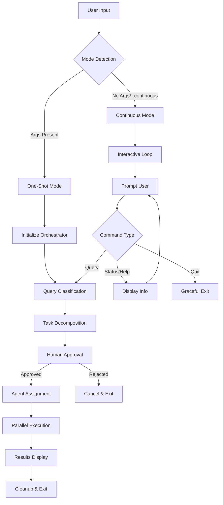
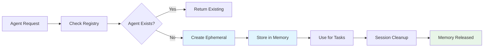

# 🏗️ Graphyn Code - System Architecture

## Overview

Graphyn Code is a dual-mode AI-powered CLI orchestrator that coordinates multiple Claude Code sessions for development tasks. This document describes the cleaned, optimized architecture implemented to prevent file accumulation and ensure reliable operation.

## 🎯 Core Design Principles

1. **Dual-Mode Operation**: Support both one-shot CLI commands and continuous interactive sessions
2. **File Pollution Prevention**: No persistent timestamped files that accumulate over time
3. **Human-in-the-Loop**: Mandatory approval checkpoints for all task decompositions
4. **Ephemeral Agents**: Dynamic agents exist only in memory during execution
5. **Clean Architecture**: Separate concerns with clear entry points and module boundaries

## 🚀 Operation Modes

### One-Shot Mode
```bash
graphyn "create a hello world script"
```
- **Purpose**: Traditional CLI behavior for quick tasks
- **Behavior**: Execute query → Display results → Exit
- **Use Cases**: CI/CD scripts, quick development tasks, automation

### Continuous Mode
```bash
graphyn                    # Interactive session
graphyn --continuous "query"  # Start with query, then continue
```
- **Purpose**: Development session management
- **Behavior**: Interactive prompt → Multiple queries → Persistent context
- **Use Cases**: Extended development sessions, iterative improvements

## 🔧 System Components

### Entry Points

#### `bin/graphyn.js` - Smart CLI Router
- **Role**: Main entry point with intelligent mode selection
- **Logic**: 
  - No args or `--continuous` flag → Continuous Mode
  - Query provided without flags → One-Shot Mode
- **Features**: Timeout protection, graceful cleanup, error handling

#### `src/cli.ts` - Ultimate Orchestrator CLI
- **Role**: Alternative entry point for development
- **Usage**: `tsx src/cli.ts` for development mode

### Core Orchestration

#### `UltimateOrchestrator.ts` - Main Orchestration Engine
```
📋 Task Decomposition → 👤 Human Approval → 🤖 Agent Assignment → ⚡ Parallel Execution
```

**Key Features:**
- Intelligent query classification (simple/moderate/enterprise)
- Human approval checkpoints with suspicious pattern detection
- Progress tracking with real-time updates
- Emergency stop functionality
- Performance monitoring

#### `UniversalTaskDecomposer.ts` - Intelligent Task Planning
- **Query Classification**: Detects simple vs complex queries
- **Task Generation**: Generates appropriate task count based on complexity
- **Over-engineering Prevention**: Built-in heuristics to avoid complex tasks for simple queries

#### `AgentSessionManager.ts` - Session Coordination
- **Session Management**: Creates and manages Claude Code sessions
- **Agent Assignment**: Maps tasks to optimal agents based on specializations
- **Cleanup**: Proper resource cleanup and session termination

### Agent System

#### `DynamicAgentRegistry.ts` - Agent Profile Management ✨ **CLEANED**

**Previous Issues (FIXED):**
- ❌ Created timestamped `.json` files on every run
- ❌ No cleanup mechanism for old files
- ❌ File accumulation in `.claude/agents/`

**Current Implementation:**
- ✅ Ephemeral agents exist only in memory (`dynamic-ephemeral` author tag)
- ✅ Automatic cleanup of old timestamped files on startup
- ✅ Static `.md` files for persistent agent definitions
- ✅ No file pollution during normal operation

**Agent Storage Strategy:**
```
.claude/agents/
├── architect.md          # Static persistent definitions
├── assistant.md
├── backend-developer.md
└── ... (other .md files)
# No .json files are created during execution
```

### Configuration & Context

#### Agent Definitions (`.claude/agents/*.md`)
- **Static Configuration**: Persistent agent personalities and capabilities
- **No Dynamic Generation**: Prevents file accumulation
- **Version Controlled**: Can be committed to Git safely

#### Package Configuration
```json
{
  "main": "dist/cli-orchestrator.js",    // Ultimate Orchestrator
  "bin": {
    "graphyn": "bin/graphyn.js"          // Smart dual-mode router
  }
}
```

## 🧹 File Pollution Prevention

### Root Cause Analysis
The original system created timestamped agent files like:
```
architect-architect-1757805036469.json
backend-backend-1757805036470.json  
```

### Solution Implementation

#### 1. Ephemeral Agent Strategy
```typescript
// OLD: Created persistent files
id: `${config.type}-${Date.now()}`

// NEW: Ephemeral in-memory only  
id: `${config.type}-ephemeral-${Date.now()}`
metadata: { author: 'dynamic-ephemeral' }
```

#### 2. Automatic Cleanup
```typescript
private async cleanupOldAgentFiles(): Promise<void> {
  const timestampedFiles = files.filter(f => 
    f.endsWith('.json') && 
    /\w+-\w+-\d{13}/.test(f) // Matches timestamped pattern
  );
  // Delete all matching files
}
```

#### 3. Save Prevention
```typescript
private async saveAgentProfile(profile: AgentProfile): Promise<void> {
  if (profile.metadata.author === 'dynamic-ephemeral') {
    return; // Skip saving ephemeral agents
  }
}
```

## 📊 System Flow

### Query Processing Flow


### Agent Lifecycle


## 🎯 Performance Characteristics

### Resource Usage
- **Memory**: ~7MB baseline, scales with active sessions
- **Disk I/O**: Minimal - only reads static `.md` files
- **File System**: Zero pollution - no temporary files created

### Execution Times
- **Simple Queries**: ~5-15 seconds (1 task, single agent)
- **Moderate Queries**: ~30-60 seconds (2-4 tasks, multiple agents)
- **Enterprise Queries**: ~2-5 minutes (5+ tasks, full orchestration)

### Scalability
- **Max Agents**: 8 parallel sessions (configurable)
- **Session Persistence**: Indefinite in continuous mode
- **Memory Growth**: Linear with session count, cleaned on exit

## 🔍 Monitoring & Observability

### Built-in Monitoring
- **Progress Tracking**: Real-time task completion percentage
- **Memory Monitoring**: Current and peak memory usage
- **Session Statistics**: Active sessions, query count, duration
- **Performance Metrics**: Execution time vs targets

### Health Checks
- **Agent Registry**: Validates agent definitions on startup
- **Session Health**: Monitors Claude Code session connectivity
- **Resource Cleanup**: Automatic cleanup on exit/error

### Debugging
- **Verbose Logging**: Detailed task execution logs
- **Error Tracking**: Comprehensive error reporting
- **Emergency Stop**: Immediate termination of all operations

## 🚨 Error Handling & Recovery

### Graceful Degradation
- **Session Failures**: Continue with remaining agents
- **Network Issues**: Retry with exponential backoff  
- **Resource Exhaustion**: Emergency stop with cleanup

### Cleanup Strategies
- **Session Termination**: Proper Claude Code session cleanup
- **Memory Management**: Clear in-memory agent profiles
- **File System**: Remove any temporary artifacts

### User Experience
- **Clear Error Messages**: Human-readable error descriptions
- **Recovery Suggestions**: Actionable next steps
- **State Preservation**: Continuous mode maintains context across errors

## 🔮 Future Extensions

### Planned Enhancements
- **Live Dashboard**: Real-time multi-panel TUI interface
- **Command Injection**: Mid-execution command processing
- **Session Persistence**: Save/restore continuous mode sessions
- **Agent Specialization**: Context-aware agent loading

### Architecture Readiness
- **Modular Design**: Easy to extend with new components
- **Event System**: Pub/sub pattern for loose coupling
- **Plugin Architecture**: Support for custom agents and tools

## ✅ System Health Verification

To verify the system is operating correctly:

```bash
# Test one-shot mode (should not create files)
graphyn "hello world"

# Test continuous mode  
graphyn
# Enter: status, quit

# Verify no file pollution
ls -la .claude/agents/ | grep json  # Should return nothing
```

The absence of `.json` files in `.claude/agents/` confirms the file pollution prevention is working correctly.

---

This architecture provides a robust, clean, and scalable foundation for AI-powered development orchestration while preventing the file accumulation issues that plagued earlier versions.
