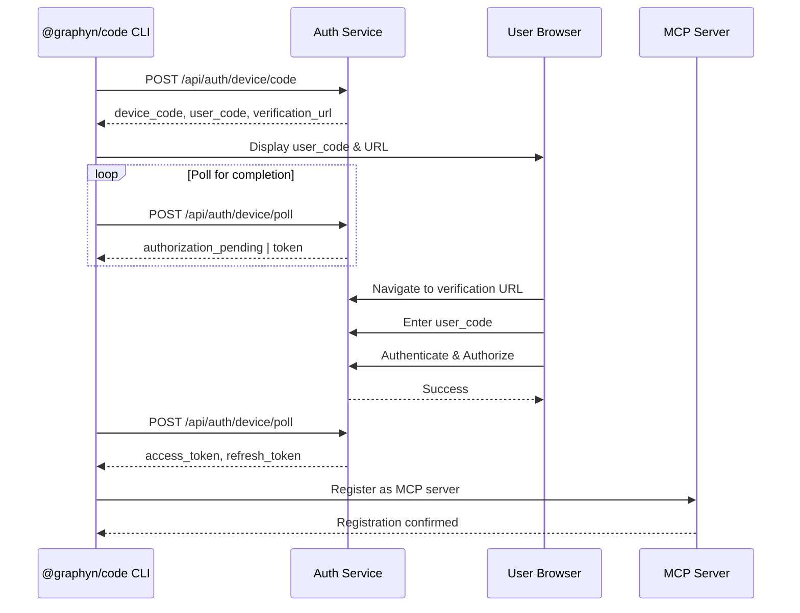

# OAuth Device Flow Implementation for @graphyn/code CLI

## Overview

This document outlines the complete OAuth device flow implementation for the @graphyn/code CLI, designed to authenticate users without requiring a browser on the same machine. This is critical for SSH sessions, CI/CD pipelines, and Claude Code integration.

## Architecture

### 1. Device Flow Sequence



## Backend API Contract

### 1. Device Code Initiation

```typescript
// POST /api/auth/device/code
interface DeviceCodeRequest {
  client_id: string;  // 'graphyn-cli-official'
  scope?: string;     // OAuth scopes requested
}

interface DeviceCodeResponse {
  device_code: string;       // Unique device identifier
  user_code: string;         // User-friendly code (e.g., "ABCD-1234")
  verification_uri: string;  // "https://app.graphyn.xyz/auth/device"
  verification_uri_complete?: string; // With user_code pre-filled
  expires_in: number;        // Seconds until device_code expires (600)
  interval: number;          // Minimum seconds between polls (5)
}
```

### 2. Device Poll Endpoint

```typescript
// POST /api/auth/device/poll
interface DevicePollRequest {
  device_code: string;
  client_id: string;
}

interface DevicePollResponse {
  // Success response
  access_token?: string;
  token_type?: string;
  expires_in?: number;
  refresh_token?: string;
  scope?: string;
  
  // Error responses
  error?: 'authorization_pending' | 'slow_down' | 'expired_token' | 'access_denied';
  error_description?: string;
}
```

### 3. Device Verification (Frontend)

```typescript
// GET /api/auth/device/verify
interface DeviceVerifyRequest {
  user_code: string;
}

interface DeviceVerifyResponse {
  valid: boolean;
  client_name?: string;  // "Graphyn CLI"
  scopes?: string[];
  expires_at?: string;
}

// POST /api/auth/device/authorize
interface DeviceAuthorizeRequest {
  user_code: string;
  user_id: string;  // From authenticated session
  organization_id: string;
  approved: boolean;
}
```

## CLI Implementation

### 1. Device Flow Manager

```typescript
// src/auth/device-flow.ts
import { EventEmitter } from 'events';
import { SecureTokenStorage } from './secure-storage-v2';

export interface DeviceFlowOptions {
  apiUrl?: string;
  clientId?: string;
  scopes?: string[];
  pollingInterval?: number;
  maxPollingTime?: number;
}

export class DeviceFlowManager extends EventEmitter {
  private apiUrl: string;
  private clientId: string;
  private storage: SecureTokenStorage;
  private pollingTimer?: NodeJS.Timeout;
  
  constructor(options: DeviceFlowOptions = {}) {
    super();
    this.apiUrl = options.apiUrl || process.env.GRAPHYN_API_URL || 'https://api.graphyn.xyz';
    this.clientId = options.clientId || 'graphyn-cli-official';
  }
  
  async authenticate(): Promise<AuthTokens> {
    // 1. Request device code
    const deviceAuth = await this.requestDeviceCode();
    
    // 2. Display user instructions
    this.displayUserInstructions(deviceAuth);
    
    // 3. Start polling
    const tokens = await this.pollForAuthorization(deviceAuth);
    
    // 4. Store tokens securely
    await this.storeTokens(tokens);
    
    // 5. Fetch user profile
    await this.fetchUserProfile(tokens.access_token);
    
    return tokens;
  }
  
  private async requestDeviceCode(): Promise<DeviceCodeResponse> {
    const response = await fetch(`${this.apiUrl}/api/auth/device/code`, {
      method: 'POST',
      headers: { 'Content-Type': 'application/json' },
      body: JSON.stringify({
        client_id: this.clientId,
        scope: 'openid profile email agents:read agents:write threads:read threads:write'
      })
    });
    
    if (!response.ok) {
      throw new Error(`Device code request failed: ${response.statusText}`);
    }
    
    return response.json();
  }
  
  private displayUserInstructions(auth: DeviceCodeResponse): void {
    console.log('\n📱 Device Authentication Required\n');
    console.log(`Please visit: ${chalk.cyan(auth.verification_uri)}`);
    console.log(`And enter code: ${chalk.yellow.bold(auth.user_code)}\n`);
    
    // Option to open browser automatically
    if (auth.verification_uri_complete) {
      console.log('Or press Enter to open your browser automatically...');
    }
  }
  
  private async pollForAuthorization(auth: DeviceCodeResponse): Promise<AuthTokens> {
    const startTime = Date.now();
    const maxTime = auth.expires_in * 1000;
    let interval = auth.interval * 1000;
    
    while (Date.now() - startTime < maxTime) {
      await this.delay(interval);
      
      try {
        const response = await fetch(`${this.apiUrl}/api/auth/device/poll`, {
          method: 'POST',
          headers: { 'Content-Type': 'application/json' },
          body: JSON.stringify({
            device_code: auth.device_code,
            client_id: this.clientId
          })
        });
        
        const data = await response.json();
        
        if (data.access_token) {
          return data as AuthTokens;
        }
        
        switch (data.error) {
          case 'authorization_pending':
            // Continue polling
            break;
          case 'slow_down':
            interval = Math.min(interval * 1.5, 30000);
            break;
          case 'expired_token':
            throw new Error('Device code expired. Please try again.');
          case 'access_denied':
            throw new Error('Authorization denied by user.');
          default:
            throw new Error(data.error_description || 'Unknown error');
        }
      } catch (error) {
        if (error instanceof Error && error.message.includes('expired')) {
          throw error;
        }
        // Network error - continue polling
      }
    }
    
    throw new Error('Authentication timeout. Please try again.');
  }
  
  private delay(ms: number): Promise<void> {
    return new Promise(resolve => setTimeout(resolve, ms));
  }
}
```

### 2. MCP Bridge Integration

```typescript
// src/mcp/bridge.ts
import { MCPServer } from '@modelcontextprotocol/sdk';
import { DeviceFlowManager } from '../auth/device-flow';

export class GraphynMCPBridge {
  private server: MCPServer;
  private authManager: DeviceFlowManager;
  private apiClient: GraphynAPIClient;
  
  async initialize(): Promise<void> {
    // 1. Authenticate via device flow
    const auth = new DeviceFlowManager();
    const tokens = await auth.authenticate();
    
    // 2. Initialize API client
    this.apiClient = new GraphynAPIClient({
      accessToken: tokens.access_token,
      refreshToken: tokens.refresh_token
    });
    
    // 3. Register MCP server
    this.server = new MCPServer({
      name: 'graphyn',
      version: '1.0.0',
      capabilities: {
        tools: true,
        resources: true,
        prompts: true
      }
    });
    
    // 4. Register tools
    this.registerTools();
    
    // 5. Start server
    await this.server.start();
  }
  
  private registerTools(): void {
    // Thread management
    this.server.addTool({
      name: 'create_thread',
      description: 'Create a new Graphyn thread',
      inputSchema: { /* ... */ },
      handler: async (params) => {
        return this.apiClient.threads.create(params);
      }
    });
    
    // Agent management
    this.server.addTool({
      name: 'spawn_agent',
      description: 'Spawn a new AI agent',
      inputSchema: { /* ... */ },
      handler: async (params) => {
        return this.apiClient.agents.create(params);
      }
    });
    
    // Squad operations
    this.server.addTool({
      name: 'configure_squad',
      description: 'Configure agent squad',
      inputSchema: { /* ... */ },
      handler: async (params) => {
        return this.apiClient.squads.configure(params);
      }
    });
  }
}
```

### 3. SDK Auto-Generation

```typescript
// src/sdk/generator.ts
import { generateApi } from 'swagger-typescript-api';
import { readFileSync, writeFileSync } from 'fs';

export class SDKGenerator {
  async generateFromOpenAPI(): Promise<void> {
    // 1. Fetch OpenAPI spec from backend
    const spec = await this.fetchOpenAPISpec();
    
    // 2. Generate TypeScript client
    const { files } = await generateApi({
      name: 'GraphynAPI',
      output: './src/generated',
      spec,
      generateClient: true,
      generateRouteTypes: true,
      httpClientType: 'fetch',
      moduleNameIndex: 1,
      templates: './templates/api',
      hooks: {
        onCreateRoute: (route) => {
          // Add auth header injection
          return {
            ...route,
            request: this.injectAuthHeader(route.request)
          };
        }
      }
    });
    
    // 3. Write generated files
    files.forEach(file => {
      writeFileSync(file.path, file.content);
    });
    
    // 4. Generate MCP tool definitions
    await this.generateMCPTools(spec);
  }
  
  private async fetchOpenAPISpec(): Promise<OpenAPISpec> {
    const response = await fetch('https://api.graphyn.xyz/openapi.json');
    return response.json();
  }
  
  private generateMCPTools(spec: OpenAPISpec): void {
    const tools = [];
    
    for (const [path, methods] of Object.entries(spec.paths)) {
      for (const [method, operation] of Object.entries(methods)) {
        if (operation.operationId) {
          tools.push({
            name: operation.operationId,
            description: operation.summary || operation.description,
            inputSchema: this.convertToJSONSchema(operation.parameters),
            handler: this.createHandler(path, method, operation)
          });
        }
      }
    }
    
    writeFileSync(
      './src/mcp/generated-tools.ts',
      `export const generatedTools = ${JSON.stringify(tools, null, 2)};`
    );
  }
}
```

## Error Handling

### 1. Device Flow Errors

```typescript
export class DeviceFlowError extends Error {
  constructor(
    message: string,
    public code: string,
    public retryable: boolean = false
  ) {
    super(message);
    this.name = 'DeviceFlowError';
  }
}

// Error recovery strategies
export class ErrorRecovery {
  static async handleAuthError(error: DeviceFlowError): Promise<void> {
    switch (error.code) {
      case 'expired_token':
        console.log('Device code expired. Starting new authentication...');
        return this.restartAuthentication();
        
      case 'slow_down':
        console.log('Rate limited. Slowing down polling...');
        return this.adjustPollingRate();
        
      case 'network_error':
        if (error.retryable) {
          console.log('Network error. Retrying...');
          return this.retryWithBackoff();
        }
        break;
        
      case 'access_denied':
        console.log('Access denied. Please check your permissions.');
        process.exit(1);
    }
  }
}
```

### 2. Retry Logic

```typescript
export class RetryManager {
  private attempts = 0;
  private maxAttempts = 3;
  private baseDelay = 1000;
  
  async executeWithRetry<T>(
    operation: () => Promise<T>,
    options: RetryOptions = {}
  ): Promise<T> {
    this.maxAttempts = options.maxAttempts || 3;
    this.baseDelay = options.baseDelay || 1000;
    
    while (this.attempts < this.maxAttempts) {
      try {
        return await operation();
      } catch (error) {
        this.attempts++;
        
        if (this.attempts >= this.maxAttempts) {
          throw error;
        }
        
        const delay = this.calculateBackoff();
        console.log(`Retry ${this.attempts}/${this.maxAttempts} in ${delay}ms...`);
        await this.delay(delay);
      }
    }
    
    throw new Error('Max retry attempts exceeded');
  }
  
  private calculateBackoff(): number {
    // Exponential backoff with jitter
    const exponential = Math.pow(2, this.attempts) * this.baseDelay;
    const jitter = Math.random() * 1000;
    return Math.min(exponential + jitter, 30000);
  }
}
```

## Security Considerations

### 1. Token Storage

```typescript
// Use system keychain for secure storage
import keytar from 'keytar';

export class SecureTokenStore {
  private service = 'graphyn-cli';
  
  async storeTokens(tokens: AuthTokens): Promise<void> {
    // Store in system keychain
    await keytar.setPassword(
      this.service,
      'access_token',
      tokens.access_token
    );
    
    if (tokens.refresh_token) {
      await keytar.setPassword(
        this.service,
        'refresh_token',
        tokens.refresh_token
      );
    }
    
    // Store metadata in encrypted file
    const metadata = {
      expires_at: new Date(Date.now() + tokens.expires_in * 1000),
      scope: tokens.scope,
      token_type: tokens.token_type
    };
    
    await this.encryptAndStore(metadata);
  }
  
  async retrieveTokens(): Promise<AuthTokens | null> {
    const accessToken = await keytar.getPassword(
      this.service,
      'access_token'
    );
    
    if (!accessToken) return null;
    
    const refreshToken = await keytar.getPassword(
      this.service,
      'refresh_token'
    );
    
    const metadata = await this.decryptAndRetrieve();
    
    return {
      access_token: accessToken,
      refresh_token: refreshToken,
      ...metadata
    };
  }
}
```

### 2. User Code Generation

```typescript
// Backend: Generate secure, user-friendly codes
export class UserCodeGenerator {
  // Use readable characters only (no ambiguous ones)
  private charset = 'ABCDEFGHJKLMNPQRSTUVWXYZ23456789';
  
  generate(): string {
    const segments = [];
    
    for (let i = 0; i < 2; i++) {
      let segment = '';
      for (let j = 0; j < 4; j++) {
        const index = crypto.randomInt(0, this.charset.length);
        segment += this.charset[index];
      }
      segments.push(segment);
    }
    
    return segments.join('-'); // e.g., "ABCD-1234"
  }
  
  validate(code: string): boolean {
    const pattern = /^[A-Z0-9]{4}-[A-Z0-9]{4}$/;
    return pattern.test(code);
  }
}
```

## Testing Strategy

### 1. Unit Tests

```typescript
// src/auth/__tests__/device-flow.test.ts
import { DeviceFlowManager } from '../device-flow';
import { mockFetch } from '../../test-utils';

describe('DeviceFlowManager', () => {
  it('should handle successful authentication', async () => {
    const manager = new DeviceFlowManager();
    
    mockFetch
      .onPost('/api/auth/device/code')
      .reply(200, {
        device_code: 'test-device-code',
        user_code: 'ABCD-1234',
        verification_uri: 'https://app.graphyn.xyz/auth/device',
        expires_in: 600,
        interval: 5
      });
    
    mockFetch
      .onPost('/api/auth/device/poll')
      .replyOnce(200, { error: 'authorization_pending' })
      .replyOnce(200, {
        access_token: 'test-access-token',
        refresh_token: 'test-refresh-token',
        expires_in: 3600,
        scope: 'openid profile email'
      });
    
    const tokens = await manager.authenticate();
    
    expect(tokens.access_token).toBe('test-access-token');
    expect(tokens.refresh_token).toBe('test-refresh-token');
  });
  
  it('should handle expired device code', async () => {
    // Test expiration handling
  });
  
  it('should respect rate limiting', async () => {
    // Test slow_down response
  });
});
```

### 2. Integration Tests

```typescript
// src/__tests__/integration/auth-flow.test.ts
import { GraphynCLI } from '../../cli';
import { TestBackend } from '../../test-utils/backend';

describe('End-to-end authentication', () => {
  let backend: TestBackend;
  let cli: GraphynCLI;
  
  beforeAll(async () => {
    backend = await TestBackend.start();
    cli = new GraphynCLI({ apiUrl: backend.url });
  });
  
  it('should complete device flow authentication', async () => {
    // Start device flow
    const authPromise = cli.authenticate();
    
    // Simulate user authorization
    await backend.simulateUserAuthorization({
      user_code: 'ABCD-1234',
      user_id: 'test-user',
      approved: true
    });
    
    // Wait for authentication to complete
    const result = await authPromise;
    
    expect(result.authenticated).toBe(true);
    expect(result.user).toBeDefined();
  });
});
```

## Implementation Timeline

### Phase 1: Core Device Flow (Week 1)
- [ ] Implement device code request endpoint
- [ ] Implement polling endpoint
- [ ] Create CLI device flow manager
- [ ] Add secure token storage

### Phase 2: MCP Integration (Week 2)
- [ ] Create MCP server bridge
- [ ] Register Graphyn tools
- [ ] Implement resource providers
- [ ] Add prompt templates

### Phase 3: SDK Generation (Week 3)
- [ ] Fetch OpenAPI spec
- [ ] Generate TypeScript client
- [ ] Create MCP tool definitions
- [ ] Add auth header injection

### Phase 4: Testing & Polish (Week 4)
- [ ] Unit tests for all components
- [ ] Integration tests
- [ ] Error handling improvements
- [ ] Documentation

## Configuration

```typescript
// .graphyn/config.json
{
  "auth": {
    "type": "device",
    "client_id": "graphyn-cli-official",
    "api_url": "https://api.graphyn.xyz",
    "polling_interval": 5,
    "max_polling_time": 600
  },
  "mcp": {
    "enabled": true,
    "server_name": "graphyn",
    "auto_register": true
  },
  "sdk": {
    "auto_generate": true,
    "openapi_url": "https://api.graphyn.xyz/openapi.json",
    "output_dir": "./src/generated"
  }
}
```

## Success Metrics

1. **Authentication Success Rate**: > 95%
2. **Average Time to Auth**: < 30 seconds
3. **Token Refresh Success**: > 99%
4. **MCP Tool Execution**: < 100ms latency
5. **SDK Generation Time**: < 5 seconds

## Next Steps

1. Review and approve this design
2. Create backend endpoints
3. Implement CLI device flow manager
4. Test with Claude Code
5. Deploy to production