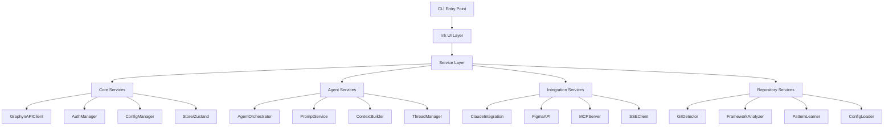

# Graphyn Code CLI Servicemap

This document provides a comprehensive overview of the Graphyn Code CLI's service architecture, designed to pair with the `sitemap.md` for complete technical documentation.

**Last Updated**: 2025-01-19

## Service Architecture Overview



## Core Services

### 1. **GraphynAPIClient** - Central API Communication

**Purpose**: Unified API client for all backend communication

**Location**: `src/api-client.ts`

**Key Responsibilities**:
- REST API communication with Encore backend
- SSE stream handling for real-time updates

## v10 New Services

### 14. **code-analysis** - Repository Intelligence Service
**Purpose**: Deep code analysis for @graphyn/code CLI

**Key Endpoints**:
```
POST   /api/code-analysis/analyze         # Analyze repository structure
GET    /api/code-analysis/suggest-agents  # Recommend agents based on code
POST   /api/code-analysis/extract-patterns # Extract coding patterns
GET    /api/code-analysis/dependencies    # Get dependency graph
```

### 15. **mcp** - Model Context Protocol Gateway
**Purpose**: Bridge between Claude and Graphyn agents

**Key Endpoints**:
```
POST   /mcp/tools                        # List available MCP tools
POST   /mcp/execute                      # Execute MCP command
GET    /mcp/context                      # Get current context
POST   /mcp/stream                       # Stream agent responses
```

### 16. **learning** - Reinforcement Learning Pipeline
**Purpose**: Continuous improvement from repository patterns

**Key Endpoints**:
```
POST   /api/learning/capture             # Capture interaction for training
POST   /api/learning/train               # Trigger model fine-tuning
GET    /api/learning/models/:orgId       # Get org-specific models
POST   /api/learning/deploy              # Deploy fine-tuned model
```
- Token management and refresh
- Request retry with exponential backoff
- Error standardization

**Key Methods**:
```typescript
class GraphynAPIClient {
  // Authentication
  async login(credentials: LoginCredentials): Promise<AuthResponse>
  async logout(): Promise<void>
  async refreshToken(): Promise<Token>
  
  // Threads
  async createThread(params: ThreadParams): Promise<Thread>
  async listThreads(): Promise<Thread[]>
  async streamThread(threadId: string): EventSource
  
  // Agents
  async listAgents(): Promise<Agent[]>
  async createAgent(config: AgentConfig): Promise<Agent>
  async deployAgent(agentId: string): Promise<Deployment>
  
  // Design
  async extractFigma(url: string): Promise<Extraction>
  async getExtraction(id: string): Promise<ExtractionResult>
}
```

**Integration Pattern**:
```typescript
// Centralized error handling
private async request<T>(endpoint: string, options?: RequestOptions): Promise<T> {
  try {
    const response = await fetch(`${this.baseUrl}${endpoint}`, {
      ...options,
      headers: {
        'Authorization': `Bearer ${this.token}`,
        'Content-Type': 'application/json',
        ...options?.headers
      }
    });
    
    if (!response.ok) {
      throw new APIError(response.status, await response.text());
    }
    
    return await response.json();
  } catch (error) {
    return this.handleError(error);
  }
}
```

---

### 2. **AuthManager** - Authentication & Session Management

**Purpose**: Handle OAuth flows, API key storage, and session persistence

**Location**: `src/auth.ts`

**Key Responsibilities**:
- OAuth 2.0 flow orchestration
- Secure token storage (system keychain)
- Session validation and refresh
- Organization context management
- Fallback to API key authentication

**Security Patterns**:
```typescript
// Secure token storage
interface SecureStorage {
  async setToken(token: string): Promise<void> {
    // Use OS keychain when available
    if (process.platform === 'darwin') {
      await keytar.setPassword('graphyn', 'token', token);
    } else {
      // Encrypted file storage fallback
      await this.encryptedFileStore.save(token);
    }
  }
}
```

---

### 3. **ConfigManager** - Configuration & Preferences

**Purpose**: Manage CLI configuration, user preferences, and project settings

**Location**: `src/config-manager.ts`

**Key Responsibilities**:
- Global config (~/.graphyn/config.yaml)
- Project config (.graphyn/config.yaml)
- Agent configurations
- Theme and UI preferences
- Shortcut mappings

**Configuration Hierarchy**:
```yaml
# Global Config (~/.graphyn/config.yaml)
version: 1
theme: "gradient"
api_url: "https://api.graphyn.xyz"
shortcuts:
  b: "backend"
  f: "frontend"
  a: "architect"

# Project Config (.graphyn/config.yaml)
project:
  name: "my-saas"
  framework: "nextjs"
  agents:
    - name: "api-specialist"
      prompt: "You are an expert in our REST API..."
```

---

### 4. **Store (Zustand)** - State Management

**Purpose**: Reactive state management for UI components

**Location**: `src/ink/store.ts`

**State Structure**:
```typescript
interface GraphynStore {
  // Authentication
  auth: {
    isAuthenticated: boolean;
    token: string | null;
    user: User | null;
    organization: Organization | null;
  };
  
  // Threads
  threads: {
    list: Thread[];
    current: Thread | null;
    messages: Message[];
    isStreaming: boolean;
  };
  
  // Agents
  agents: {
    available: Agent[];
    selected: Agent | null;
    custom: CustomAgent[];
  };
  
  // UI State
  ui: {
    view: ViewType;
    loading: boolean;
    error: Error | null;
    notification: Notification | null;
  };
  
  // Actions
  actions: {
    login: (credentials: LoginCredentials) => Promise<void>;
    createThread: (params: ThreadParams) => Promise<Thread>;
    selectAgent: (agent: Agent) => void;
    setView: (view: ViewType) => void;
  };
}
```

---

## Agent Services

### 1. **AgentOrchestrator** - Multi-Agent Coordination

**Purpose**: Orchestrate multiple agents for complex tasks

**Location**: `src/services/agent-orchestrator.ts`

**Key Features**:
- Parallel agent execution
- Response aggregation
- Context sharing between agents
- Dependency resolution

**Orchestration Patterns**:
```typescript
// Multi-agent task execution
async executeMultiAgentTask(task: ComplexTask): Promise<AggregatedResponse> {
  // 1. Analyze task dependencies
  const plan = this.planner.createExecutionPlan(task);
  
  // 2. Execute in parallel where possible
  const results = await Promise.all(
    plan.parallelSteps.map(step => 
      this.executeAgentStep(step)
    )
  );
  
  // 3. Sequential execution for dependent steps
  for (const step of plan.sequentialSteps) {
    await this.executeAgentStep(step, results);
  }
  
  // 4. Aggregate and return
  return this.aggregator.combine(results);
}
```

---

### 2. **PromptService** - Intelligent Prompt Management

**Purpose**: Load, enhance, and manage agent prompts

**Location**: `src/services/agent-prompt-service.ts`

**Key Features**:
- Dynamic prompt loading
- Context injection
- Repository-aware enhancements
- Template variable resolution

**Prompt Enhancement**:
```typescript
async getEnhancedPrompt(
  agentType: string, 
  userPrompt: string,
  context: ProjectContext
): Promise<string> {
  // 1. Load base prompt
  const basePrompt = await this.loadPrompt(agentType);
  
  // 2. Inject repository context
  const contextSection = this.buildContextSection(context);
  
  // 3. Add learning insights
  const patterns = await this.patternLearner.getRelevantPatterns(userPrompt);
  
  // 4. Combine intelligently
  return this.combinePrompts({
    base: basePrompt,
    context: contextSection,
    patterns: patterns,
    user: userPrompt
  });
}
```

---

### 3. **ContextBuilder** - Project Context Assembly

**Purpose**: Build comprehensive context for agent interactions

**Key Responsibilities**:
- Repository analysis
- Dependency scanning
- Pattern detection
- Historical context

**Context Assembly**:
```typescript
interface ProjectContext {
  repository: {
    name: string;
    framework: Framework;
    dependencies: Dependency[];
    structure: FileTree;
  };
  patterns: {
    components: ComponentPattern[];
    apis: APIPattern[];
    testing: TestPattern[];
  };
  history: {
    recentChanges: GitCommit[];
    agentInteractions: Interaction[];
  };
  configuration: {
    linting: LintConfig;
    building: BuildConfig;
    deployment: DeployConfig;
  };
}
```

---

### 4. **ThreadManager** - Conversation Management

**Purpose**: Handle thread lifecycle and message streaming

**Location**: `src/ink/components/ThreadManagement.tsx`

**Key Features**:
- Thread CRUD operations
- Real-time SSE streaming
- Participant management
- Message history

---

## Integration Services

### 1. **ClaudeIntegration** - Claude Code Bridge

**Purpose**: Seamless integration with Claude Code desktop app

**Location**: `src/ink/hooks/useClaude.ts`

**Integration Method**:
```typescript
// Direct argument passing - no temp files!
async launchWithContext(content: string): Promise<void> {
  const escaped = this.escapeForShell(content);
  const command = `claude "${escaped}"`;
  
  try {
    await execa(command, { shell: true });
  } catch (error) {
    // Fallback to temp file if needed
    await this.launchWithTempFile(content);
  }
}
```

---

### 2. **FigmaAPI** - Design Extraction Service

**Purpose**: Extract and convert Figma designs to code

**Location**: `src/figma-api.ts`

**Key Features**:
- OAuth authentication
- Design token extraction
- Component analysis
- I18n text extraction

**Extraction Pipeline**:
```typescript
async extractDesign(figmaUrl: string): Promise<DesignExtraction> {
  // 1. Parse Figma URL
  const { fileId, nodeId } = this.parseUrl(figmaUrl);
  
  // 2. Fetch design data
  const fileData = await this.figmaClient.getFile(fileId);
  const nodeData = await this.figmaClient.getNode(fileId, nodeId);
  
  // 3. Extract design tokens
  const tokens = {
    colors: this.extractColors(nodeData),
    typography: this.extractTypography(nodeData),
    spacing: this.extractSpacing(nodeData),
    shadows: this.extractShadows(nodeData)
  };
  
  // 4. Generate component structure
  const components = this.analyzeComponents(nodeData);
  
  // 5. Extract text for i18n
  const translations = this.extractText(nodeData);
  
  return { tokens, components, translations };
}
```

---

### 3. **MCPServer** - Model Context Protocol

**Purpose**: Provide enhanced context to Claude via MCP

**Location**: `src/services/mcp-server.ts` (bundled)

**MCP Tools Provided**:
```typescript
const mcpTools = {
  // Repository context
  getProjectStructure: async () => this.repository.getStructure(),
  getFileContents: async (path: string) => this.repository.readFile(path),
  searchCode: async (query: string) => this.repository.search(query),
  
  // Agent context
  getAgentPrompt: async (agent: string) => this.prompts.get(agent),
  getAgentHistory: async (agent: string) => this.history.get(agent),
  
  // Design context
  getFigmaTokens: async () => this.figma.getStoredTokens(),
  getComponentLibrary: async () => this.components.getLibrary()
};
```

---

### 4. **SSEClient** - Real-time Streaming

**Purpose**: Handle Server-Sent Events for live updates

**Location**: `src/ink/hooks/useAPI.ts`

**Features**:
- Auto-reconnection with backoff
- Message buffering
- Connection health monitoring
- Event type routing

**SSE Pattern**:
```typescript
class SSEClient {
  private reconnectAttempts = 0;
  private messageBuffer: Message[] = [];
  
  connect(url: string, token: string): EventSource {
    const eventSource = new EventSource(`${url}?token=${token}`);
    
    eventSource.onmessage = (event) => {
      const data = JSON.parse(event.data);
      this.handleMessage(data);
    };
    
    eventSource.onerror = () => {
      this.handleReconnect();
    };
    
    return eventSource;
  }
  
  private handleReconnect(): void {
    const delay = Math.min(1000 * Math.pow(2, this.reconnectAttempts), 30000);
    setTimeout(() => this.connect(), delay);
    this.reconnectAttempts++;
  }
}
```

---

## Repository Services

### 1. **GitDetector** - Repository Analysis

**Purpose**: Analyze git repository for context

**Location**: `src/utils/repository-detector.ts`

**Detection Capabilities**:
- Repository root detection
- Branch information
- Recent commits
- Changed files
- Author patterns

---

### 2. **FrameworkAnalyzer** - Framework Detection

**Purpose**: Identify and analyze project frameworks

**Location**: `src/utils/repository-detector.ts`

**Supported Frameworks**:
```typescript
const frameworkDetectors = {
  nextjs: {
    files: ['next.config.js', 'next.config.ts'],
    dependencies: ['next'],
    patterns: ['pages/', 'app/']
  },
  react: {
    files: ['src/App.jsx', 'src/App.tsx'],
    dependencies: ['react', 'react-dom'],
    patterns: ['src/components/']
  },
  vue: {
    files: ['vue.config.js'],
    dependencies: ['vue'],
    patterns: ['src/components/*.vue']
  },
  angular: {
    files: ['angular.json'],
    dependencies: ['@angular/core'],
    patterns: ['src/app/']
  }
};
```

---

### 3. **PatternLearner** - Code Pattern Recognition

**Purpose**: Learn and recognize coding patterns

**Key Features**:
- Component patterns
- API patterns
- State management patterns
- Testing patterns

**Pattern Recognition**:
```typescript
interface PatternSignature {
  type: 'component' | 'hook' | 'api' | 'test';
  frequency: number;
  examples: CodeExample[];
  confidence: number;
}

async detectPatterns(codebase: string): Promise<PatternSignature[]> {
  const patterns = await this.scanner.scan(codebase);
  
  return patterns
    .map(p => this.analyzer.analyze(p))
    .filter(p => p.confidence > 0.7)
    .sort((a, b) => b.frequency - a.frequency);
}
```

---

### 4. **ConfigLoader** - Project Configuration

**Purpose**: Load and merge configuration from multiple sources

**Configuration Sources**:
1. Default configuration
2. Global user configuration
3. Project configuration
4. Environment variables
5. Command-line arguments

---

## Infrastructure Services

### Build Pipeline

**Build Process**:
```bash
# TypeScript → ESM modules
tsc --module ESNext --target ES2022

# Bundle for distribution
./scripts/build-ink.sh

# Output structure
dist/
├── ink/           # UI components
├── services/      # Service layer
├── utils/         # Utilities
└── graphyn-wrapper.js  # Entry point
```

### Testing Infrastructure

**Test Stack**:
- Vitest for unit tests
- Ink Testing Library for UI tests
- Mock Service Worker for API mocking

**Test Patterns**:
```typescript
// Component testing
import { render } from 'ink-testing-library';

test('MainMenu navigation', () => {
  const { lastFrame } = render(<MainMenu />);
  expect(lastFrame()).toContain('Work with Agents');
});

// Service testing
test('API client retry logic', async () => {
  const client = new GraphynAPIClient();
  mockServer.use(
    rest.get('/api/agents', (req, res, ctx) => {
      return res.once(ctx.status(500));
    })
  );
  
  const agents = await client.listAgents();
  expect(agents).toBeDefined(); // Retry succeeded
});
```

### Error Handling Architecture

**Error Hierarchy**:
```typescript
class GraphynError extends Error {
  constructor(
    message: string,
    public code: ErrorCode,
    public recoverable: boolean = true
  ) {
    super(message);
  }
}

class APIError extends GraphynError {}
class AuthError extends GraphynError {}
class NetworkError extends GraphynError {}
class ConfigError extends GraphynError {}
```

### Performance Monitoring

**Key Metrics**:
```typescript
interface PerformanceMetrics {
  cliStartup: number;      // Target: < 500ms
  apiResponse: number;     // Target: < 200ms
  claudeLaunch: number;    // Target: < 1s
  figmaExtraction: number; // Target: < 5s
  frameworkDetection: number; // Target: < 100ms
}
```

## Deployment & Distribution

### NPM Package Structure

```
@graphyn/code/
├── dist/              # Compiled code
├── prompts/           # Agent prompts
├── templates/         # Project templates
├── scripts/
│   └── postinstall.js # Post-install setup
├── package.json
├── README.md
└── LICENSE
```

### Installation Flow

```typescript
// postinstall.js
async function postInstall() {
  // 1. Check system requirements
  await checkNodeVersion();
  await checkGitInstalled();
  
  // 2. Setup directories
  await createConfigDirectory();
  
  // 3. Install shell completions
  await installCompletions();
  
  // 4. Show success message
  console.log('✨ Graphyn Code installed successfully!');
  console.log('Run "graphyn init" to get started.');
}
```

## Security Architecture

### Token Security
- OAuth tokens stored in system keychain
- API keys encrypted at rest
- Token refresh before expiration
- Secure token transmission

### API Security
- HTTPS only communication
- Request signing for sensitive operations
- Rate limiting awareness
- Automatic retry with backoff

## Future Service Enhancements

### 1. **Local SLM Integration** (v10)
- Fuego model management
- Local inference pipeline
- Model fine-tuning interface
- RLHF implementation

### 2. **Advanced Learning** (v10)
- Pattern database
- Cross-project learning
- Team knowledge sharing
- Automated improvements

### 3. **Enterprise Features** (v10)
- SSO integration
- Audit logging
- Compliance tools
- Advanced RBAC

---

This servicemap provides the complete technical architecture of the Graphyn Code CLI, showing how all services work together to create an intelligent development experience.